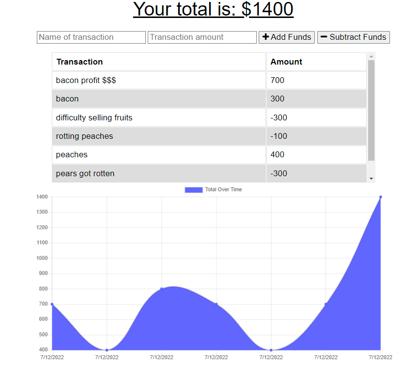

# Nomadic Frugality
## Description

This is a simple budget tracker. The main purpose of this project was to allow users to be able to track their finances on the go. The app utilizes a service-worker and IndexedDB for offline capabilities, as well as a web manifest to allow users to download the application directly onto their mobile device or system.

## Table of Contents

- [Installation](#installation)
- [Usage](#usage)
- [License](#license)
- [Contributing](#contributing)
- [Questions](#questions)

## Installation

Installation allows for the app to be used without internet connect and is optional. Full functionality can be accessed with an internet connect at [https://whispering-fjord-65900.herokuapp.com/](https://whispering-fjord-65900.herokuapp.com/)

To install, visit the link above and click the installation icon in your browser's URL bar.

## Usage

Type a name for the transaction, the add the transaction value. Click "Add Funds" to add to add the value to your total funds, or "Subtract Funds" to remove the value from your funds. If you go offline due to nomadic lifestyle, transactions are saved locally. When you go back online the saved transactions will be updated to the cloud database.

## License

## Contributing

* Professional readme template generated using [https://github.com/chardmuffin/readme-generator-rth](https://github.com/chardmuffin/readme-generator-rth)
* Uses [Mongoose](https://www.npmjs.com/package/mongoose) package for MongoDB object modeling tool
* Uses the [express.js](https://www.npmjs.com/package/express) framework
* Deployed on Heroku
* User [IndexedDB](https://www.npmjs.com/package/idb)

## Questions

I am on GitHub: [https://github.com/chardmuffin](https://github.com/chardmuffin)

I can also be reached by email at [richardhuffman96@gmail.com](mailto:richardhuffman96@gmail.com)